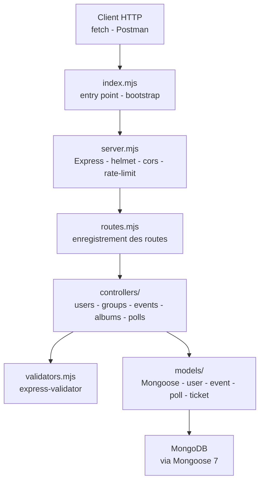

   

# TP Social Media

<!-- adam-badges:start -->
[](https://github.com/Adam-Blf/TP-Social-Media/commits) [](https://hits.sh/github.com/Adam-Blf/TP-Social-Media/) [](https://github.com/Adam-Blf/TP-Social-Media/commits) [](https://github.com/Adam-Blf/TP-Social-Media) [](LICENSE)
<!-- adam-badges:end -->


Backend REST d'une API reseau social. TP Efrei, stack Node.js + Express + MongoDB avec securite et validation.

## Architecture



## Stack

- Node.js 20 (ES modules)
- Express 4 + body-parser + compression
- MongoDB via Mongoose 7
- Securite - helmet + cors + express-rate-limit + express-validator
- dotenv pour la configuration
- Deploiement - Render (voir `render.yaml`)

## Structure

- `api/` - source de l'API Express
  - `index.mjs` - entry point
  - `src/` - routes, controllers, models, middlewares
  - `public/` - assets statiques
  - `docs/` - documentation API
- `render.yaml` - config deploiement Render (plan free)

## Lancement

```bash
git clone https://github.com/Adam-Blf/TP-Social-Media
cd TP-Social-Media/api
npm install
cp .env.example .env   # puis renseigner MONGO_URI
npm run dev            # lint + dev
npm run prod           # production
```

## Endpoints principaux

- `POST /auth/register` - creation compte
- `POST /auth/login` - authentification
- `GET /posts` - liste des posts
- `POST /posts` - creation post
- Validation via express-validator, rate-limiting actif

## Licence

MIT

---

<p align="center">
  <sub>Par <a href="https://adam.beloucif.com">Adam Beloucif</a> - Data Engineer & Fullstack Developer - <a href="https://github.com/Adam-Blf">GitHub</a> - <a href="https://www.linkedin.com/in/adambeloucif/">LinkedIn</a></sub>
</p>


## Star History

<a href="https://www.star-history.com/?repos=Adam-Blf%2FTP-Social-Media&type=date&legend=top-left">
 <picture>
   <source media="(prefers-color-scheme: dark)" srcset="https://api.star-history.com/chart?repos=Adam-Blf/TP-Social-Media&type=date&theme=dark&legend=top-left" />
   <source media="(prefers-color-scheme: light)" srcset="https://api.star-history.com/chart?repos=Adam-Blf/TP-Social-Media&type=date&legend=top-left" />
   
 </picture>
</a>
